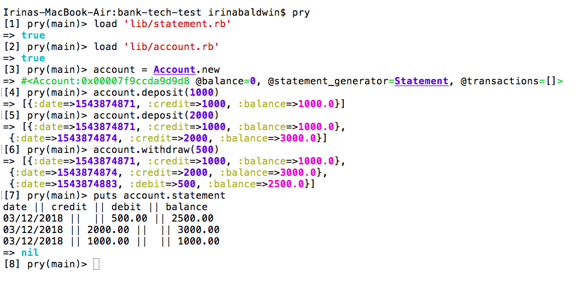
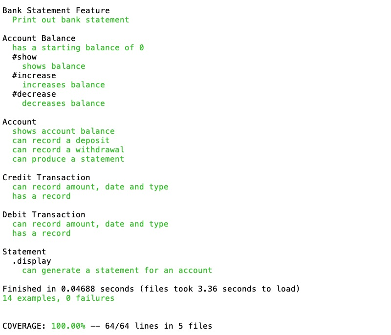

## Bank Tech Test

This is a simple bank account program. It allows the user:
- to create an account
- to make a deposit
- to make a withdrawal
- to see a statement

## How to Run It

- Fork and clone this repo
- In the terminal, run ```bundle install``` from root directory
- You can interact with the app from your terminal
- In your terminal, run PRY or IRB. Here is what you can do:



## How to Test It

- From the terminal, run: ```rspec spec --format documentation```

- You should see something similar to this:



## My Approach

I've designed five classes:
- Account, which holds transactions and provides a customer interface: deposit,
  withdrawal, show_balance and statement methods
- CreditTransaction - records transaction of type: credit
- DebitTransaction - records transaction of type: debit
- Balance, which enables updating of balance and holds current balance
- Statement, which formats and displays an account statement

## Dependencies

I've used the following gems:
- Rspec for unit testing
- Capybara for feature testing
- Simplecov for test coverage
- Rubocop for linting
- Flog for code complexity
